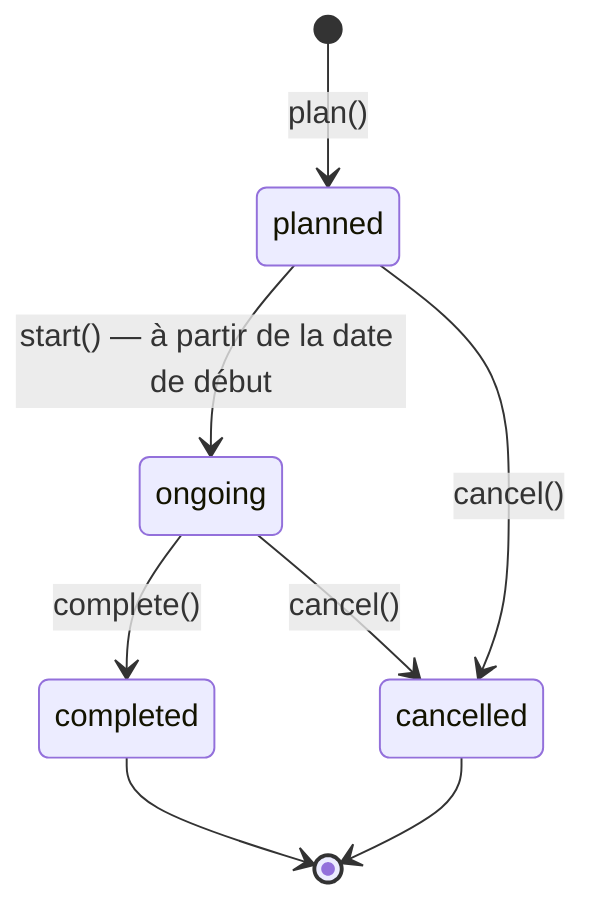

# 0006 — Stages : machine à états et garanties d'intégrité

- **Statut :** Accepté
- **Date :** 2026-10-03

## Contexte

Un stage relie un stagiaire, un encadrant et une période. Trois règles métier
sont critiques, car leur violation produirait des données incohérentes :

1. un stagiaire n'a jamais **deux stages actifs qui se chevauchent** ;
2. un encadrant ne dépasse jamais sa **capacité** (`max_interns`, 5 par défaut) ;
3. le **statut** d'un stage suit un cycle de vie précis.

Vérifier ces règles dans le code (« SELECT puis INSERT ») ne suffit pas : deux
requêtes simultanées peuvent passer la vérification avant que l'une n'écrive.

## Décision

### 1. Machine à états portée par l'entité

- Les transitions sont des **méthodes** de `Internship` (`start`, `complete`, `cancel`) ;
  toute autre transition lève `InvalidStatusTransitionError`.
- L'API expose des **actions** (`POST /internships/{id}/start`…) et non un `PATCH`
  du champ `status` : le client exprime une intention, l'entité décide.

### 2. Chaque règle a une garantie au niveau de la base

| Règle | Vérification applicative | Garantie PostgreSQL |
|---|---|---|
| Pas de chevauchement | `has_active_overlap()` → message clair | **Contrainte d'exclusion** `ex_internships_intern_overlap` (GiST sur `daterange`, statuts actifs seulement) |
| Capacité de l'encadrant | `ensure_can_supervise_one_more()` | **Verrou de ligne** `SELECT … FOR UPDATE` sur l'encadrant pendant la planification |
| Période valide | `DateRange` refuse fin ≤ début | `CHECK (end_date > start_date)` |
| Statut connu | `InternshipStatus` | `CHECK (status IN (…))` |
| Références valides | stagiaire / encadrant existants | clés étrangères `ON DELETE RESTRICT` |

La vérification applicative produit un message métier précis ; la contrainte de
la base est le **filet de sécurité** en cas de concurrence. Les violations de
contraintes connues sont traduites en exceptions métier par les repositories
(nom de contrainte fourni par le pilote psycopg).

### 3. Calcul prudent de la capacité

La charge d'un encadrant est le nombre de stages actifs qui **chevauchent** la
période demandée. C'est une sur-estimation possible (deux stages consécutifs
dans la période comptent tous deux), choisie pour sa simplicité et parce qu'elle
ne laisse jamais dépasser la capacité.

## Alternatives envisagées

- **Vérifications applicatives seules** : simples, mais fausses sous concurrence.
- **Isolation `SERIALIZABLE`** pour toute l'application : correct, mais impose de
  rejouer les transactions en échec et masque l'intention métier.
- **Champ `status` modifiable librement (PATCH)** : permettrait de passer de
  `cancelled` à `ongoing` sans contrôle.

## Conséquences

- ✅ Les règles critiques tiennent même avec plusieurs instances de l'API.
- ✅ Des tests d'intégration le prouvent (course simulée, verrou mesuré).
- ⚠️ Dépendance à PostgreSQL (`btree_gist`, contrainte d'exclusion) : acceptée,
  PostgreSQL étant déjà notre base de référence (ADR 0004).
