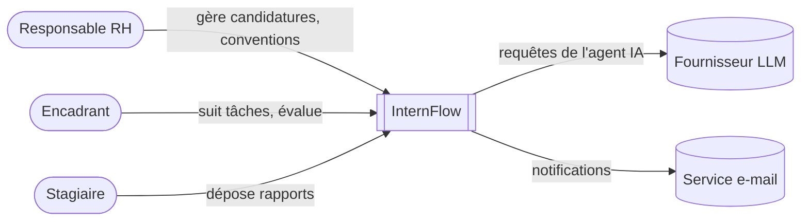
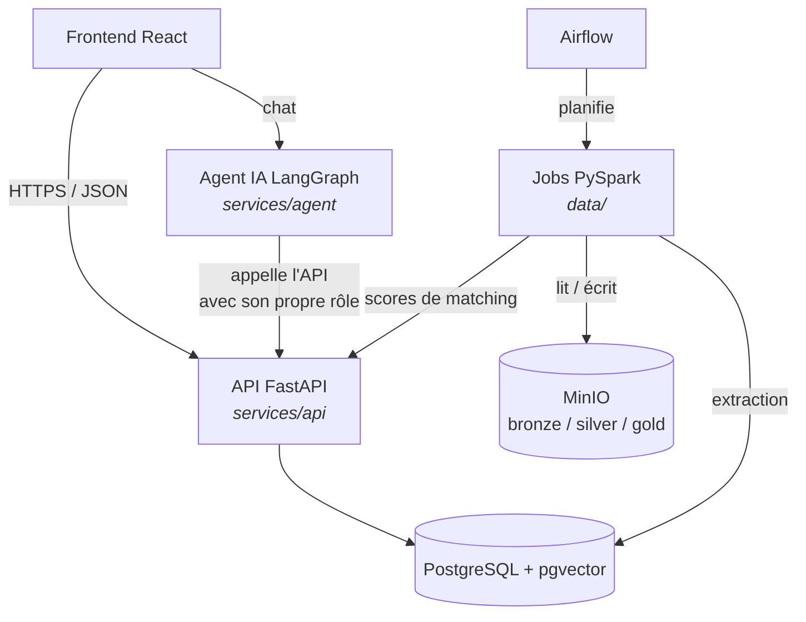
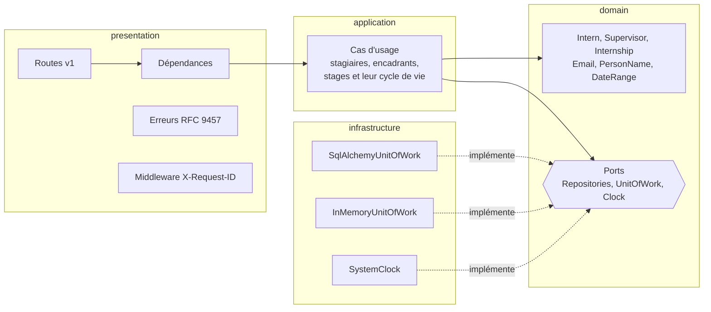
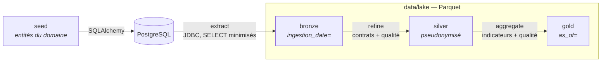

# Architecture (modèle C4)

## Niveau 1 — Contexte

## Niveau 2 — Conteneurs (cible)

| Conteneur | État |
|-----------|------|
| API FastAPI | ✅ Stagiaires, encadrants, stages, rôles, tâches et rapports hebdomadaires |
| PostgreSQL | ✅ Phase 1 |
| Jobs PySpark (bronze / silver / gold sur disque local) | ✅ Phase 3 |
| MinIO + Airflow | ⏳ Phase 3 |
| Modèle de matching (MLlib + MLflow) | ⏳ Phase 4 |
| Agent IA | ⏳ Phase 5 |
| Frontend | ⏳ Phase 6 |

## Niveau 3 — Composants du service API

Décision détaillée : [ADR 0002](../adr/0002-architecture-hexagonale.md).

## Niveau 3 — Pipeline de données

